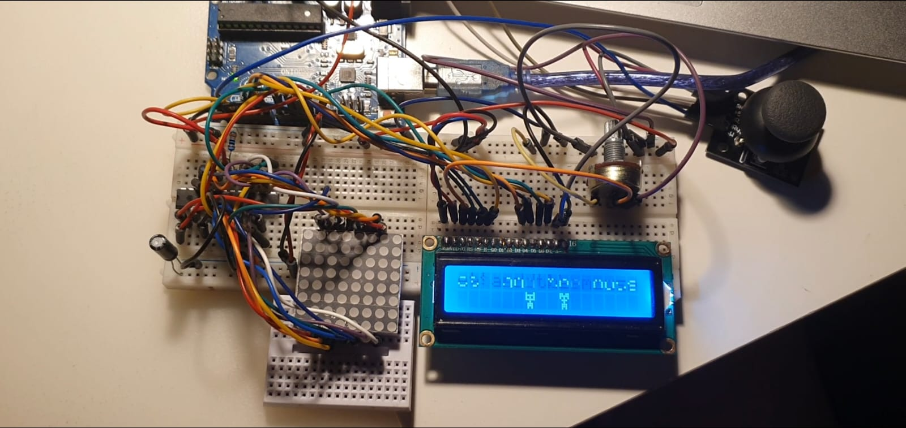

# Matrix-Mini-Game - The cat and the mouse!
This repo includes the mini-project for the '**Introduction to Robotics**' course, taken in the third year at the _Faculty of Mathematics and Computer Science, University of Bucharest (2022-2023)_. The project comes with the appropriate details and requirements, as well with the source code and images.

  <h2> Task requirements </h2>
  
  <h3> Components </h3>
  <ul>
    <li> 8x8 Matrix </li>
    <li>Liquid Crystal Display </li>
    <li> 1 joystick </li>
    <li> 1 10μF condenser</li>
    <li> 1 ceramic condensor </li>
    <li> Resistors </li>
    <li> Wires </li>
  </ul>
  
  <h3> Description </h3>
The goal of the project was to create a mini-game which comes with a fully functional menu. The game consists of a 8x8 board (represented by the 8x8 matrix), on which the player (cat) must move with the joystick in order to catch the appearing blinking dot (mouse).

The score increases with each dot reached and is printed on the LCD. If the button is pressed while playing, the game ends and a quit message is shown. If pressed one more time, the stats of the player are shown.

  <h2> Setup Images </h2>
  -Tov View-
  
  
   
   <h2> Source code </h2>
  
 You can also find the main code <a href="https://github.com/AlinaGeo/Matrix-Mini-Game/blob/main/MatrixMiniGameWrapper/MatrixMiniGameWrapper.ino">here</a>. 

  
 Check out all the source files <a href="https://github.com/AlinaGeo/Matrix-Mini-Game/blob/main/MatrixMiniGameWrapper">here</a>.

